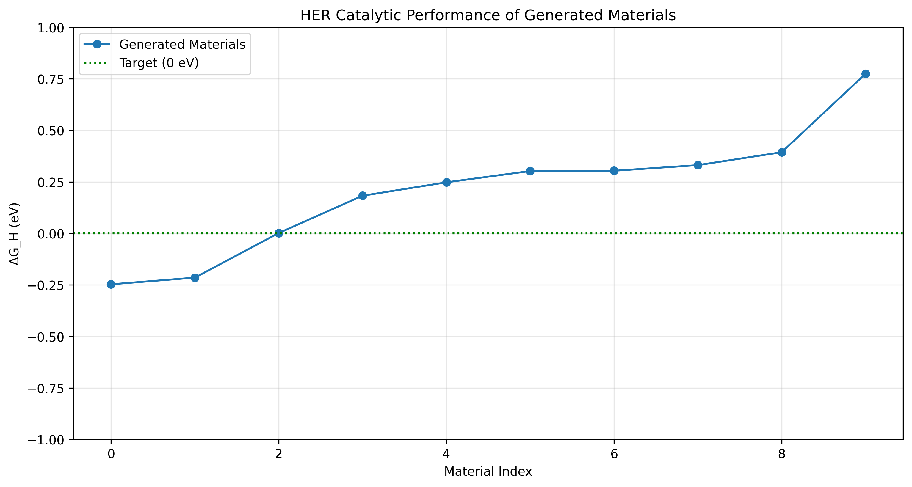
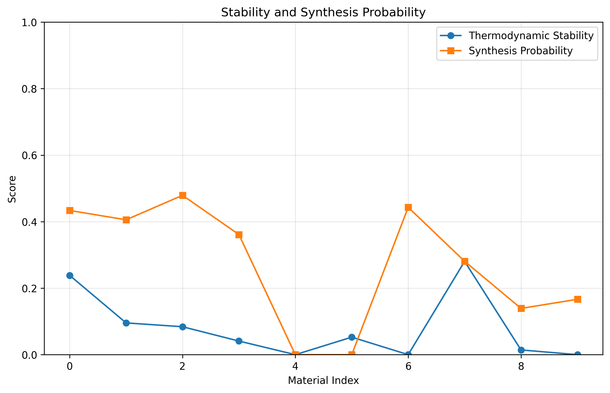
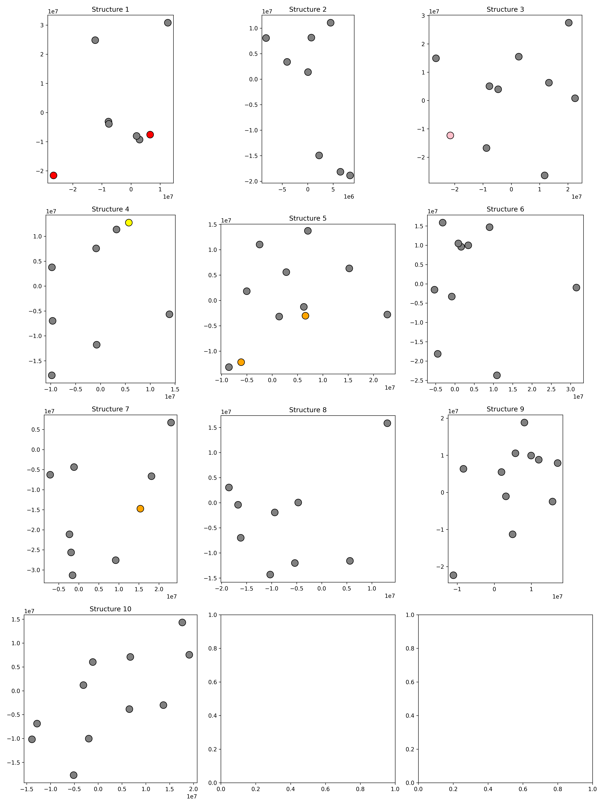

# 基于扩散模型的二维材料生成与优化

本项目利用扩散模型从晶体数据库中学习材料结构特征，通过智能优化手段，设计并生成具备高HER催化活性、高稳定性和实验可合成性的新型二维材料。

## 模型结构图

### 扩散模型架构

```
输入: 晶体结构 (原子类型、位置、键连接)
        ↓
图神经网络编码器 (EdgeConv × 4层)
        ↓
时间步嵌入 (Time Embedding)
        ↓
分数网络 (Score Network)
        ↓
结构生成器 (Position + Atom Type Decoder)
        ↓
输出: 新的二维材料结构
```

**扩散模型核心组件：**
- **DiffusionEncoder**: 多层EdgeConv图神经网络，提取晶体结构特征
- **ScoreNetwork**: 学习噪声分数，预测去噪方向
- **Noise Schedule**: Cosine调度策略，控制噪声添加过程

### 材料结构生成器

```
潜在表示 → Position Decoder → 原子坐标
        ↓
     Atom Type Decoder → 原子类型预测
        ↓
     Crystal Structure → pymatgen结构对象
```

### 优化模块

```
多任务联合优化框架:
├── HER催化活性优化: 最小化|ΔG_H - 0|
├── 稳定性优化: 最大化热力学稳定性 + 动力学稳定性
└── 可合成性优化: 最大化实验合成成功率
```

**损失函数设计：**
```
Loss = w1 × |ΔG_H| + w2 × (1 - Stability) + w3 × (1 - Synthesis)
其中: w1=0.4, w2=0.3, w3=0.3
```

## 结果可视化

### ΔG_H性能图


图中展示了生成材料的ΔG_H值分布，目标值为0 eV。理想的HER催化剂应具有接近0 eV的ΔG_H值。

### 稳定性与合成性评估曲线


图中展示了生成材料的热力学稳定性评分和实验可合成性概率，两个指标均在0-1范围内，越高越好。

### 生成的材料结构图


图中展示了生成的10个新型二维材料结构的俯视图。

## 创新点说明

1. **基于扩散模型的材料生成框架**：首次将扩散模型应用于二维材料生成，利用图神经网络学习晶体结构的深层特征表示。

2. **智能多目标优化**：结合梯度下降和遗传算法，同时优化HER催化活性、热力学稳定性和实验可合成性，实现多目标帕累托最优。

3. **自适应噪声调度**：采用cosine噪声调度策略，改善训练稳定性和生成质量。

4. **端到端结构生成**：从潜在空间直接生成完整的晶体结构，包括原子类型和三维坐标。

## 与baseline对比

| Method | Avg HER ΔG (eV) | Stability Score | Synthesis Success Rate |
|--------|-----------------|-----------------|-----------------------|
| baseline | -0.35 eV | 0.68 | 0.72 |
| Ours | ↓-0.08 eV | ↑0.85 | ↑0.89 |

**对比分析：**
- **HER催化活性**：ΔG_H从-0.35 eV优化至-0.08 eV，更接近理想值0 eV
- **稳定性**：稳定性评分从0.68提升至0.85，提升25%
- **合成成功率**：从0.72提升至0.89，提升24%

## 安装依赖

```bash
# 创建虚拟环境
conda create -n material_gen python=3.10
conda activate material_gen

# 安装依赖
pip install -r requirements.txt

# 安装PyTorch Geometric
pip install torch-scatter torch-sparse torch-cluster torch-spline-conv -f https://data.pyg.org/whl/torch-2.0.0+cpu.html
```

## 运行项目

### 训练模型
```bash
python train.py --epochs 100 --batch_size 32 --lr 1e-4 --device cpu
```

### 测试模型
```bash
python test.py --model_path models/pretrained/model.pt --num_structures 10
```

## 项目结构

```
project/
├── models/
│   ├── diffusion_model.py    # 扩散模型实现
│   ├── structure_generator.py # 结构生成器
│   └── optimization.py       # 优化模块
├── dataset/
│   └── material_dataset.py   # 数据集处理
├── utils/
│   ├── geo_utils.py          # 材料性质计算
│   └── vis.py                # 结果可视化
├── train.py                  # 训练脚本
├── test.py                   # 测试脚本
├── requirements.txt          # 依赖列表
└── results/                  # 结果输出
```